# Serverless Patterns


[WorkShopのリンク](https://catalog.workshops.aws/serverless-patterns/en-US)。`M2 - Synchronous Invocation`と`M3 - Synchronous + Idempotence`の2つを実装。

## アーキテクチャ


大きくは2種類のAPIを構築している。

### `/users`
* ユーザー情報を管理するAPI
* バックエンドのLambda関数は単一かつモノリス構成（1つの関数の中でメソッド等で分岐させている）。
* 認証はカスタムオーソライザーでCognitoのIDトークンを検証している。

### `/ordesr`
* 注文の管理を行うAPI
* APIごとにLambda関数を分割している。
* 認証はCognitoオーソライザーを使用している。
* `create_table`のみLambda Powertoolsを使用し、冪等性の確保やログ拡張、メトリクス拡張を行なっている。


# APIを叩く方法

## 事前準備
CognitoにサインインしてIDトークンを取得する

```sh
aws cognito-idp initiate-auth --auth-flow USER_PASSWORD_AUTH --client-id COGNITO_CLIET_ID --auth-parameters USERNAME=YOUR_USERNAME,PASSWORD=YOUR_PASSWORD
```

## users
IDトークンをAuthorizationヘッダに付与してAPIを叩く

```sh
# 特定のユーザー情報を取得
curl https://USERS_API_ENDPOINT/Prod/users/YOUR_USER_NAME  -H "Authorization:ID_TOKEN"

# ユーザーに関するデータを更新
curl --location --request PUT 'https://USERS_API_ENDPOINT/Prod/users/YOUR_USER_NAME' \
--data-raw '{"name": "My name is hogehoge"}' \
--header "Authorization: ID_TOKEN" \
--header "Content-Type: application/json" \

# ユーザーのリストを取得
curl https://USERS_API_ENDPOINT/Prod/users  -H "Authorization:ID_TOKEN"
```

## orders

```sh
curl --location --request POST 'https://zg1er2uto2.execute-api.ap-northeast-1.amazonaws.com/Prod/orders' \
--data-raw '{"restaurantId":1,"orderId": "hogehoge","orderItems":[{"id":1,"name":"Spaghetti","price":9.99,"quantity":1},{"id":2,"name":"Pizza - SMALL","price":4.99,"quantity":2}],"totalAmount":19.97}' \
--header "Authorization:eyJraWQiOiJUejJLWU93eFFUMEltZ1wvazJwXC8wQ2pVWHZ6WWgzc0ZOUmtac3pQVDhxdU09IiwiYWxnIjoiUlMyNTYifQ.eyJzdWIiOiJhOTAxODU5MS01NTNmLTQwNTQtOGU5MS1mYzJlYmM1MDhmOWQiLCJjb2duaXRvOmdyb3VwcyI6WyJhcGlBZG1pbnMiXSwiZW1haWxfdmVyaWZpZWQiOnRydWUsImlzcyI6Imh0dHBzOlwvXC9jb2duaXRvLWlkcC5hcC1ub3J0aGVhc3QtMS5hbWF6b25hd3MuY29tXC9hcC1ub3J0aGVhc3QtMV82YzBEbWNkdlciLCJjb2duaXRvOnVzZXJuYW1lIjoiYTkwMTg1OTEtNTUzZi00MDU0LThlOTEtZmMyZWJjNTA4ZjlkIiwib3JpZ2luX2p0aSI6IjgxOGZlZjg3LTQ1YWItNGU4OC1hNGFlLTJiYzFlNTc4NThmZiIsImF1ZCI6IjY1aGJjM2plbHE0b3N0N2VuMjlmbnZuaG8zIiwiZXZlbnRfaWQiOiIxYjJlYzJiNi0zMjY0LTQxNmEtYWQwOC0yZWRlZTQ3ZTBiM2YiLCJ0b2tlbl91c2UiOiJpZCIsImF1dGhfdGltZSI6MTcwMzg2NDQwNSwibmFtZSI6ImhvZ2Vob2dlIiwiZXhwIjoxNzAzODY4MDA1LCJpYXQiOjE3MDM4NjQ0MDUsImp0aSI6IjhiMjNkZmUwLTBjMjEtNDE0Mi05ZDExLTdhM2Q4YjkyNTQ3YSIsImVtYWlsIjoieWl5dGguZmNiNkBnbWFpbC5jb20ifQ.NyeNZsm0rqDdepmMJpN_wZ34Y112eYqE8RsbwSBv02HFTM50aX3YQYD4jc2FWCPojO_rYfyzwy5KBlgFi3XuVsoNlG__8fvkZDqv6DuT07Ac22HO52e1-3Ryr4U5invRRiG1SC0PKXZeutqvYYdU-i6du_LbCdHLSFyc_seZ8HcLjLoMfppso5r3rbtLbA6iV5BJojdzvSbCurlE0H6pyZuyJNo5rc8uGza32b8o7oQF_mmq0Sbnsbfw-8uene1AdERVZfCg7tbQ_aaopHJgIRx53tPUXYqRnBidppUEuZHJUb3zA_d7O-iecZiEP1ivIGeg5WKfNl-hOWYgQHXbUA" \


curl https://zg1er2uto2.execute-api.ap-northeast-1.amazonaws.com/Prod/orders/hogehoge  -H "Authorization:eyJraWQiOiJUejJLWU93eFFUMEltZ1wvazJwXC8wQ2pVWHZ6WWgzc0ZOUmtac3pQVDhxdU09IiwiYWxnIjoiUlMyNTYifQ.eyJzdWIiOiJhOTAxODU5MS01NTNmLTQwNTQtOGU5MS1mYzJlYmM1MDhmOWQiLCJjb2duaXRvOmdyb3VwcyI6WyJhcGlBZG1pbnMiXSwiZW1haWxfdmVyaWZpZWQiOnRydWUsImlzcyI6Imh0dHBzOlwvXC9jb2duaXRvLWlkcC5hcC1ub3J0aGVhc3QtMS5hbWF6b25hd3MuY29tXC9hcC1ub3J0aGVhc3QtMV82YzBEbWNkdlciLCJjb2duaXRvOnVzZXJuYW1lIjoiYTkwMTg1OTEtNTUzZi00MDU0LThlOTEtZmMyZWJjNTA4ZjlkIiwib3JpZ2luX2p0aSI6ImZmNGExM2M3LWE4ZDgtNDAzZS04NmVkLTI1ZDJkZWFmNGIxMyIsImF1ZCI6IjY1aGJjM2plbHE0b3N0N2VuMjlmbnZuaG8zIiwiZXZlbnRfaWQiOiJlYjk1YTk5Zi1lZjI1LTQ2MDUtOGY0ZS0yMWE2OWU1MDBkNGMiLCJ0b2tlbl91c2UiOiJpZCIsImF1dGhfdGltZSI6MTcwMzg3MDY2NSwibmFtZSI6ImhvZ2Vob2dlIiwiZXhwIjoxNzAzODc0MjY1LCJpYXQiOjE3MDM4NzA2NjUsImp0aSI6IjNjNDAyYWIyLWM2MDYtNDE5ZC04ZDQwLWRjNDdkN2NjMDhmYiIsImVtYWlsIjoieWl5dGguZmNiNkBnbWFpbC5jb20ifQ.L487_JxmEYBiYIeBOKxzvrDwUz6qCAPwQA8gvK99DVmsYO51VwcnDbxfKuAx3ic3tanpwFP8DW_PKjnTxPAb-8Tqj88zgSmYIN00ndOQjJSRrmCzNkH64O71hQheivU8LpPmydSy3aiHW5uzClTqbHKOpA9s5tsUwoArlFIaka3cZwWvpbzq1Ex4jwWVIHT0shiMNQKRkxSyrRNtQbtCD9L3gm7PRAJhHIAhjF8zo0lv7lSYWdIMJ7LeNAzJAUjfXHBcVqsDOy2Lr9tuCg_BuWulNLwZ2WJn6eZXku5cYG-AltE2oy3MLVLEcYQ80nWgnAlnlcpu8NQOAfWqCga7RA"


curl https://zg1er2uto2.execute-api.ap-northeast-1.amazonaws.com/Prod/orders  -H "Authorization:eyJraWQiOiJTM1hIWnVjNnBQNGE2R3l0N09NVmlLcWlMOHQ4Uzl1VU1MRW56TlZlM1JjPSIsImFsZyI6IlJTMjU2In0.eyJzdWIiOiIzNTZmZWUxNi03ZTExLTRjNjMtYmY1MC00YTZlNDM2ZTZlMzAiLCJpc3MiOiJodHRwczpcL1wvY29nbml0by1pZHAuYXAtbm9ydGhlYXN0LTEuYW1hem9uYXdzLmNvbVwvYXAtbm9ydGhlYXN0LTFfNmMwRG1jZHZXIiwiY2xpZW50X2lkIjoiNjVoYmMzamVscTRvc3Q3ZW4yOWZudm5obzMiLCJvcmlnaW5fanRpIjoiYmY0NGUyNjItOTg0My00ZTQ1LWIwNDYtYTY0ODVjNGM4Njg2IiwiZXZlbnRfaWQiOiI2ZTkzM2YxNy0zOTA1LTQ5YjMtODNiMi02NGFjNTlhMjhmZjMiLCJ0b2tlbl91c2UiOiJhY2Nlc3MiLCJzY29wZSI6ImF3cy5jb2duaXRvLnNpZ25pbi51c2VyLmFkbWluIiwiYXV0aF90aW1lIjoxNzA0NjM0ODc0LCJleHAiOjE3MDQ2Mzg0NzQsImlhdCI6MTcwNDYzNDg3NCwianRpIjoiNTdlZjQzMmEtMTA4YS00NTM2LTk3MDMtOTVmODg2MDlmODc0IiwidXNlcm5hbWUiOiIzNTZmZWUxNi03ZTExLTRjNjMtYmY1MC00YTZlNDM2ZTZlMzAifQ.HTPCY1ihfaOWRM7UVHx74dQAmxUW5wiPsXw0KEGhs9M9rQBfqOfqfh3lujGL1hkYEzXBRDq9lv0gh20EeOiCQ_2ac6zggrr4WkpxUD4XUzoOuoaC6GiW45Jm8fqs2uKQF4VaeVQYQJKUdlO_BqFD5M-mb7aR4VtvlTt6SHo3YWkHouisHh17FvIhw8pyPYKaUM2pTyEWfos6CF_aOfubyPQ0VwU38dwhWacQsfnQBpcMdypKbmpxJWLch1VeQGWbY5f9CZ_LDOb_AOi4BzohMsoxSt_mM2U2EQYAFiV559BK-rZhF9cAxD3RjnjWrUjdAwQVHuITuGGdvGdLG7R8qQ"


curl --location --request PUT 'https://zg1er2uto2.execute-api.ap-northeast-1.amazonaws.com/Prod/orders/hogehoge' \
--data-raw '{"restaurantId":1,"orderId": "hogehoge","orderItems":[{"id":1,"name":"Spaghetti","price":9.99,"quantity":1},{"id":2,"name":"Pizza - SMALL","price":4.99,"quantity":2},{"id":3,"name":"Salad - LARGE","price":9.99,"quantity":1}
],"totalAmount":19.97}' \
--header "Authorization:eyJraWQiOiJUejJLWU93eFFUMEltZ1wvazJwXC8wQ2pVWHZ6WWgzc0ZOUmtac3pQVDhxdU09IiwiYWxnIjoiUlMyNTYifQ.eyJzdWIiOiJhOTAxODU5MS01NTNmLTQwNTQtOGU5MS1mYzJlYmM1MDhmOWQiLCJjb2duaXRvOmdyb3VwcyI6WyJhcGlBZG1pbnMiXSwiZW1haWxfdmVyaWZpZWQiOnRydWUsImlzcyI6Imh0dHBzOlwvXC9jb2duaXRvLWlkcC5hcC1ub3J0aGVhc3QtMS5hbWF6b25hd3MuY29tXC9hcC1ub3J0aGVhc3QtMV82YzBEbWNkdlciLCJjb2duaXRvOnVzZXJuYW1lIjoiYTkwMTg1OTEtNTUzZi00MDU0LThlOTEtZmMyZWJjNTA4ZjlkIiwib3JpZ2luX2p0aSI6IjgxOGZlZjg3LTQ1YWItNGU4OC1hNGFlLTJiYzFlNTc4NThmZiIsImF1ZCI6IjY1aGJjM2plbHE0b3N0N2VuMjlmbnZuaG8zIiwiZXZlbnRfaWQiOiIxYjJlYzJiNi0zMjY0LTQxNmEtYWQwOC0yZWRlZTQ3ZTBiM2YiLCJ0b2tlbl91c2UiOiJpZCIsImF1dGhfdGltZSI6MTcwMzg2NDQwNSwibmFtZSI6ImhvZ2Vob2dlIiwiZXhwIjoxNzAzODY4MDA1LCJpYXQiOjE3MDM4NjQ0MDUsImp0aSI6IjhiMjNkZmUwLTBjMjEtNDE0Mi05ZDExLTdhM2Q4YjkyNTQ3YSIsImVtYWlsIjoieWl5dGguZmNiNkBnbWFpbC5jb20ifQ.NyeNZsm0rqDdepmMJpN_wZ34Y112eYqE8RsbwSBv02HFTM50aX3YQYD4jc2FWCPojO_rYfyzwy5KBlgFi3XuVsoNlG__8fvkZDqv6DuT07Ac22HO52e1-3Ryr4U5invRRiG1SC0PKXZeutqvYYdU-i6du_LbCdHLSFyc_seZ8HcLjLoMfppso5r3rbtLbA6iV5BJojdzvSbCurlE0H6pyZuyJNo5rc8uGza32b8o7oQF_mmq0Sbnsbfw-8uene1AdERVZfCg7tbQ_aaopHJgIRx53tPUXYqRnBidppUEuZHJUb3zA_d7O-iecZiEP1ivIGeg5WKfNl-hOWYgQHXbUA" \


curl --location --request DELETE 'https://zg1er2uto2.execute-api.ap-northeast-1.amazonaws.com/Prod/orders/hogehoge' \
--header "Authorization:eyJraWQiOiJUejJLWU93eFFUMEltZ1wvazJwXC8wQ2pVWHZ6WWgzc0ZOUmtac3pQVDhxdU09IiwiYWxnIjoiUlMyNTYifQ.eyJzdWIiOiJhOTAxODU5MS01NTNmLTQwNTQtOGU5MS1mYzJlYmM1MDhmOWQiLCJjb2duaXRvOmdyb3VwcyI6WyJhcGlBZG1pbnMiXSwiZW1haWxfdmVyaWZpZWQiOnRydWUsImlzcyI6Imh0dHBzOlwvXC9jb2duaXRvLWlkcC5hcC1ub3J0aGVhc3QtMS5hbWF6b25hd3MuY29tXC9hcC1ub3J0aGVhc3QtMV82YzBEbWNkdlciLCJjb2duaXRvOnVzZXJuYW1lIjoiYTkwMTg1OTEtNTUzZi00MDU0LThlOTEtZmMyZWJjNTA4ZjlkIiwib3JpZ2luX2p0aSI6IjgxOGZlZjg3LTQ1YWItNGU4OC1hNGFlLTJiYzFlNTc4NThmZiIsImF1ZCI6IjY1aGJjM2plbHE0b3N0N2VuMjlmbnZuaG8zIiwiZXZlbnRfaWQiOiIxYjJlYzJiNi0zMjY0LTQxNmEtYWQwOC0yZWRlZTQ3ZTBiM2YiLCJ0b2tlbl91c2UiOiJpZCIsImF1dGhfdGltZSI6MTcwMzg2NDQwNSwibmFtZSI6ImhvZ2Vob2dlIiwiZXhwIjoxNzAzODY4MDA1LCJpYXQiOjE3MDM4NjQ0MDUsImp0aSI6IjhiMjNkZmUwLTBjMjEtNDE0Mi05ZDExLTdhM2Q4YjkyNTQ3YSIsImVtYWlsIjoieWl5dGguZmNiNkBnbWFpbC5jb20ifQ.NyeNZsm0rqDdepmMJpN_wZ34Y112eYqE8RsbwSBv02HFTM50aX3YQYD4jc2FWCPojO_rYfyzwy5KBlgFi3XuVsoNlG__8fvkZDqv6DuT07Ac22HO52e1-3Ryr4U5invRRiG1SC0PKXZeutqvYYdU-i6du_LbCdHLSFyc_seZ8HcLjLoMfppso5r3rbtLbA6iV5BJojdzvSbCurlE0H6pyZuyJNo5rc8uGza32b8o7oQF_mmq0Sbnsbfw-8uene1AdERVZfCg7tbQ_aaopHJgIRx53tPUXYqRnBidppUEuZHJUb3zA_d7O-iecZiEP1ivIGeg5WKfNl-hOWYgQHXbUA" \